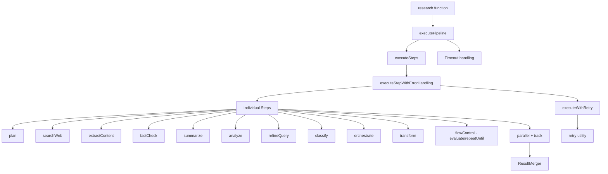
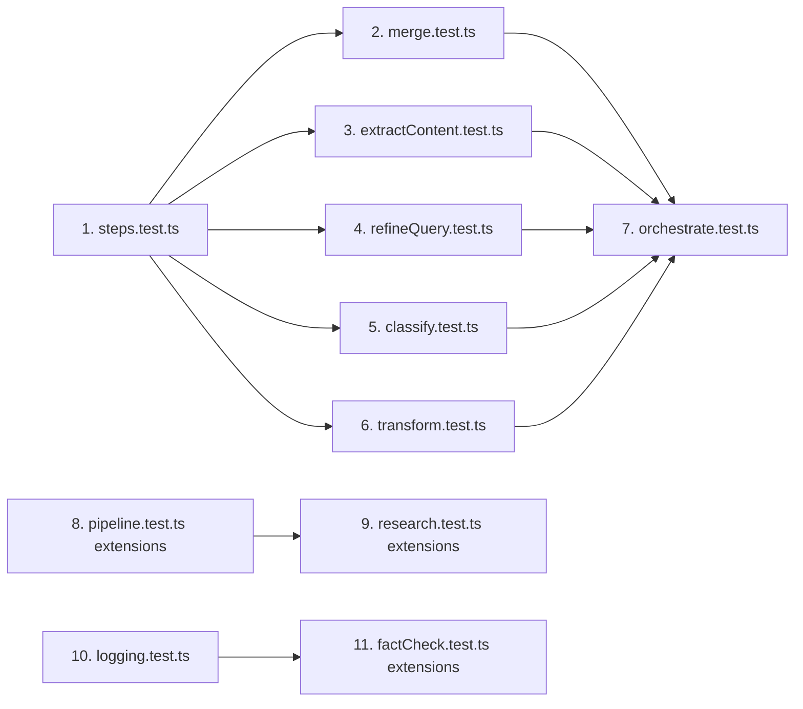

# Comprehensive Test Coverage Plan

## Overview

This document outlines a comprehensive plan to add tests to the `research-pipeline-sdk` project, ensuring all critical flows are covered. The analysis is based on a review of the existing source code and test suite.

---

## Current Test Coverage Summary

### What Is Already Tested

| Module | Test File | Coverage Notes |
|--------|-----------|----------------|
| `src/core/pipeline.ts` | `tests/core/pipeline.test.ts` | Basic step execution, error handling (stop/continue), state passing, step history |
| `src/core/research.ts` | `tests/core/research.test.ts` | Input validation, schema validation, custom steps, provider config |
| `src/core/research.ts` | `tests/research.test.ts` | Top-level integration test for the `research()` API (complements `tests/core/research.test.ts`) |
| `src/steps/analyze.ts` | `tests/steps/analyze.test.ts` | Focus, depth, recommendations, empty content, errors |
| `src/steps/factCheck.ts` | `tests/steps/factCheck.test.ts` | Basic fact checking |
| `src/steps/flowControl.ts` | `tests/steps/flowControl.test.ts` | evaluate, repeatUntil, maxIterations |
| `src/steps/parallel.ts` | `tests/steps/parallel.test.ts` | Multi-track, merge strategies, error handling |
| `src/steps/plan.ts` | `tests/steps/plan.test.ts` | Plan creation, results inclusion, errors |
| `src/steps/searchWeb.ts` | `tests/steps/searchWeb.test.ts` | Queries, plan queries, deduplication, provider fallback |
| `src/steps/summarize.ts` | `tests/steps/summarize.test.ts` | Formats, maxLength, factsOnly, empty content |
| `src/steps/track.ts` | `tests/steps/track.test.ts` | Isolation, shared data, errors, continueOnError |
| `src/types/errors.ts` | `tests/types/errors.test.ts` | All error classes, type guards |
| `src/utils/retry.ts` | `tests/utils/retry.test.ts` | Retry logic, backoff, custom retryable, onRetry |

### What Is NOT Tested (Gaps)

| Module | Gap Description |
|--------|----------------|
| `src/steps/classify.ts` | **No test file exists** |
| `src/steps/extractContent.ts` | **No test file exists** |
| `src/steps/orchestrate.ts` | **No test file exists** |
| `src/steps/refineQuery.ts` | **No test file exists** |
| `src/steps/transform.ts` | **No test file exists** |
| `src/utils/logging.ts` | **No test file exists** |
| `src/utils/merge.ts` | **No test file exists** (only used indirectly via parallel tests) |
| `src/utils/steps.ts` | **No test file exists** (`createStep`, `wrapStepWithErrorHandling`) |
| `src/types/errorCodes.ts` | **No test file exists** |
| `src/core/pipeline.ts` | Missing: rollback strategy, timeout behavior, retryable steps, `createInitialState` |
| `src/core/research.ts` | Missing: pipeline error propagation, no-results scenario, `continueOnError` config |

---

## Architecture of the Test Suite



---

## Detailed Test Plan

### 1. `tests/steps/extractContent.test.ts` — NEW FILE

**Priority: High** — This step makes real HTTP requests and has complex error handling.

#### Test Cases

| Test | Description |
|------|-------------|
| `should skip extraction when no search results exist` | State with empty `searchResults` → returns state unchanged |
| `should extract content from search result URLs` | Mock axios, verify `extractedContent` populated |
| `should respect maxUrls option` | Only process first N URLs |
| `should respect maxContentLength option` | Truncate content to max length |
| `should skip URLs with content shorter than minContentLength` | Short content → added to `failedUrls` |
| `should continue on URL failure when continueOnError is true` | One URL fails, others succeed |
| `should throw when continueOnError is false and a URL fails` | Throws `ExtractionError` or `NetworkError` |
| `should throw when requireSuccessful is true and all URLs fail` | Throws `ExtractionError` |
| `should throw ValidationError for invalid URL format` | Malformed URL → `ValidationError` |
| `should include extracted content in results when includeInResults is true` | Results array populated |
| `should not include extracted content in results when includeInResults is false` | Results array empty |
| `should handle network errors (ECONNREFUSED, ETIMEDOUT)` | Throws `NetworkError` |
| `should handle HTTP 4xx errors` | Throws `ExtractionError` |
| `should handle HTTP 5xx errors` | Throws `ExtractionError` with retry=true |
| `should use custom CSS selectors when provided` | Selector option respected |
| `should fall back to body content when no selector matches` | Body text extracted |
| `should populate extraction metadata` | `extractionMetadata` in state |
| `should use defaultSearchProvider from state` | No explicit provider needed |

**Mock Strategy:** Mock `axios` module to return controlled HTML responses. Use `jest.mock('axios')`.

---

### 2. `tests/steps/refineQuery.test.ts` — NEW FILE

**Priority: High** — Core research loop step, used in iterative research.

#### Test Cases

| Test | Description |
|------|-------------|
| `should generate refined queries using simulation mode` | `useSimulation: true` → returns array of `RefinedQuery` |
| `should respect maxQueries option` | Returns at most N queries |
| `should refine based on findings strategy` | `basedOn: 'findings'` uses search results and extracted content |
| `should refine based on gaps strategy` | `basedOn: 'gaps'` uses research plan |
| `should refine based on factuality strategy` | `basedOn: 'factuality'` uses fact checks |
| `should refine based on all strategy` | `basedOn: 'all'` combines all data |
| `should use LLM when provided` | Mock `generateObject`, verify called with correct schema |
| `should fall back to simulation when no LLM provided` | No LLM → simulation used |
| `should use defaultLLM from state when no explicit LLM` | `state.defaultLLM` used |
| `should include refined queries in results when includeInResults is true` | Results array populated |
| `should not include refined queries in results when includeInResults is false` | Results array empty |
| `should store refined queries in state.data.refinedQueries` | Data field populated |
| `should handle LLM errors gracefully` | Mock LLM throws → `LLMError` thrown |
| `should handle JSON parse errors from LLM` | LLM returns invalid JSON → `LLMError` |
| `should handle rate limit errors from LLM` | Rate limit message → `LLMError` with retry=true |
| `should update metadata with query refinement time` | `queryRefinementTimeMs` in metadata |

**Mock Strategy:** Use `mockLLM` from `test-utils.ts`. Mock `generateObject` from `ai` package (already mocked globally).

---

### 3. `tests/steps/classify.test.ts` — NEW FILE

**Priority: Medium** — Entity classification and clustering.

#### Test Cases

| Test | Description |
|------|-------------|
| `should skip classification when no extracted content exists` | Empty `extractedContent` → warning added, state returned |
| `should classify entities from extracted content` | Entities populated in `state.data.classification` |
| `should cluster entities when clusterEntities is true` | Clusters populated |
| `should not cluster entities when clusterEntities is false` | No clusters |
| `should respect confidenceThreshold option` | Low-confidence entities filtered |
| `should throw ValidationError for invalid confidenceThreshold` | Value outside 0-1 range |
| `should respect maxEntities option` | Entity count capped |
| `should respect maxClusters option` | Cluster count capped |
| `should update metadata with classification counts` | `entityCount`, `clusterCount`, `relationshipCount` in metadata |
| `should set hasClassification flag in metadata` | `metadata.hasClassification === true` |
| `should handle space-related queries` | Space entities extracted (NASA, SpaceX, Mars) |
| `should handle climate-related queries` | Climate entities extracted |
| `should handle custom entity types` | `customEntityTypes` option respected |
| `should handle processing errors gracefully` | Throws `ProcessingError` |
| `should handle LLM JSON parse errors` | Throws `LLMError` |
| `should handle rate limit errors` | Throws `LLMError` with retry=true |

**Mock Strategy:** Use fake timers (`jest.useFakeTimers()`) since `simulateEntityClassification` uses `setTimeout`.

---

### 4. `tests/steps/transform.test.ts` — NEW FILE

**Priority: High** — This is the final step in every default pipeline; schema compliance is critical.

#### Test Cases

| Test | Description |
|------|-------------|
| `should apply custom transformFn when provided` | Custom function result used |
| `should use LLM transformation when useLLM is true and LLM available` | Mock `generateObject`, verify called |
| `should fall back to default transformation when useLLM is false` | No LLM call made |
| `should fall back to default transformation when no LLM available` | `useLLM: true` but no LLM → default logic |
| `should validate output against schema after transformation` | Valid output passes |
| `should throw ValidationError when output fails schema validation` | Invalid output → `ValidationError` |
| `should fix missing fields with defaults when allowMissingWithDefaults is true` | Missing fields filled |
| `should skip validation when skipValidation is true` | No schema check |
| `should use state.defaultLLM when no explicit LLM provided` | `state.defaultLLM` used |
| `should throw ConfigurationError when useLLM is true but no LLM available` | `ConfigurationError` thrown |
| `should handle LLM generateObject failure and fall back to generateText` | Fallback path tested |
| `should handle LLM rate limit errors` | `LLMError` with retry=true |
| `should update state metadata after transformation` | `transformApplied`, `transformTimestamp`, `transformMethod` set |
| `should replace last result in state.results` | Results array updated correctly |
| `should handle empty results array gracefully` | No crash when results is empty |
| `should use custom systemPrompt when provided` | Custom prompt passed to LLM |
| `should respect temperature option` | Temperature passed to LLM |

**Mock Strategy:** Use `mockLLM` from `test-utils.ts`. Mock `generateObject` and `generateText` from `ai` (already mocked globally).

---

### 5. `tests/steps/orchestrate.test.ts` — NEW FILE

**Priority: Medium** — Complex AI-driven orchestration loop.

#### Test Cases

| Test | Description |
|------|-------------|
| `should throw ConfigurationError when no model provided` | Missing `model` → `ConfigurationError` |
| `should throw ValidationError when maxIterations is 0 or negative` | Invalid value → `ValidationError` |
| `should use custom toolSelectorFn when provided` | Custom selector called instead of LLM |
| `should execute tools selected by toolSelectorFn` | Tool step executed |
| `should stop when toolSelectorFn returns finish` | Loop exits on finish |
| `should respect maxIterations limit` | Loop stops after N iterations |
| `should start with plan step when no research plan exists` | Plan tool called first |
| `should skip plan step when research plan already exists` | Plan not called again |
| `should continue on tool error when continueOnError is true` | Error logged, loop continues |
| `should stop on tool error when continueOnError is false` | Error propagated |
| `should include orchestration results when includeInResults is true` | Results populated |
| `should add built-in tools automatically` | plan, searchWeb, extractContent etc. added |
| `should use searchProvider from options for searchWeb tool` | Provider passed correctly |
| `should use defaultSearchProvider from state when no explicit provider` | State provider used |
| `should record iteration history in state.data.orchestration` | Iterations array populated |
| `should use custom tools when provided` | Custom tool map respected |
| `should use exitCriteria function to stop early` | Custom exit condition respected |

**Mock Strategy:** Use `mockLLM` with `toolSelectorFn` to avoid actual LLM calls. Mock individual step executions.

---

### 6. `tests/utils/merge.test.ts` — NEW FILE

**Priority: Medium** — Conflict resolution is critical for parallel research correctness.

#### Test Cases

| Test | Description |
|------|-------------|
| `mergeTrackData - should merge data from multiple tracks` | All keys from all tracks present |
| `mergeTrackData - should use first strategy` | First track value wins |
| `mergeTrackData - should use last strategy` | Last track value wins |
| `mergeTrackData - should use mostConfident strategy` | Highest confidence value wins |
| `mergeTrackData - should use majority strategy` | Most common value wins |
| `mergeTrackData - should use weighted strategy for numeric values` | Weighted average computed |
| `mergeTrackData - should use weighted strategy for non-numeric values` | Highest weight value wins |
| `mergeTrackData - should use custom strategy` | Custom resolver called |
| `mergeTrackData - should throw when weighted strategy has no weights` | Error thrown |
| `mergeTrackData - should throw when custom strategy has no resolver` | Error thrown |
| `mergeTrackData - should skip tracks key` | `tracks` key not merged |
| `mergeTrackResults - should merge results from multiple tracks` | Results combined |
| `mergeTrackResults - should handle tracks with no results` | Empty results handled |
| `createMergeFunction - should return a callable merge function` | Function returned |
| `createMergeFunction - should produce correct metadata` | `mergeStrategy`, `tracksCount`, `mergedAt` set |

---

### 7. `tests/utils/logging.test.ts` — NEW FILE

**Priority: Low** — Logging is infrastructure; basic coverage is sufficient.

#### Test Cases

| Test | Description |
|------|-------------|
| `should log messages at or above the configured level` | Level filtering works |
| `should not log messages below the configured level` | Suppressed messages |
| `should include timestamp when includeTimestamp is true` | Timestamp in output |
| `should not include timestamp when includeTimestamp is false` | No timestamp |
| `should include step name when set` | Step name in output |
| `should call custom loggers when provided` | Custom logger function called |
| `should use correct console method for each level` | debug→console.debug, error→console.error etc. |
| `createStepLogger - should create a step-specific logger` | Step name included in messages |
| `createStepLogger - should restore previous step name after logging` | Step context restored |
| `setLogLevel - should update the minimum log level` | Level change takes effect |

---

### 8. `tests/utils/steps.test.ts` — NEW FILE

**Priority: Medium** — `createStep` and `wrapStepWithErrorHandling` are used by every step.

#### Test Cases

| Test | Description |
|------|-------------|
| `createStep - should create a step with the given name` | `step.name` matches |
| `createStep - should execute the executor function` | Executor called with state |
| `createStep - should update metadata.currentStep during execution` | `currentStep` set |
| `createStep - should wrap non-ResearchError in BaseResearchError` | Generic error wrapped |
| `createStep - should pass through ResearchError unchanged` | Research error not double-wrapped |
| `createStep - should retry when retryable is true` | Retry mechanism engaged |
| `createStep - should not retry when retryable is false` | No retry on failure |
| `wrapStepWithErrorHandling - should wrap an existing step` | Original step executed |
| `wrapStepWithErrorHandling - should add retry behavior` | Retry added to non-retryable step |
| `wrapStepWithErrorHandling - should include rollback when original has rollback` | Rollback preserved |
| `wrapStepWithErrorHandling - should handle rollback errors` | Rollback error propagated |

---

### 9. Additional Tests for `tests/core/pipeline.test.ts` — EXTEND EXISTING

**Priority: High** — Critical pipeline behaviors not yet covered.

#### Missing Test Cases

| Test | Description |
|------|-------------|
| `should handle rollback strategy when a step fails` | `errorHandling: 'rollback'` triggers `step.rollback()` |
| `should continue after rollback when continueOnError is true` | Pipeline continues post-rollback |
| `should handle rollback failure gracefully` | Rollback throws → error added to state |
| `should timeout when pipeline exceeds timeout limit` | `timeout: 100` with slow step → `PipelineError` |
| `should clear timeout after successful execution` | No memory leak |
| `should retry a retryable step on failure` | `step.retryable = true` → retry attempted |
| `createInitialState - should create state with correct initial values` | All fields initialized |
| `createInitialState - should set query and outputSchema` | Values stored correctly |
| `should record step duration in stepHistory` | `duration` in step metadata |
| `should handle empty steps array` | No steps → state returned unchanged |

---

### 10. Additional Tests for `tests/core/research.test.ts` — EXTEND EXISTING

**Priority: High** — Main API entry point.

#### Missing Test Cases

| Test | Description |
|------|-------------|
| `should throw ConfigurationError when default steps used without defaultLLM in non-test env` | Env check works |
| `should throw ValidationError when pipeline produces no results` | Empty results → `ValidationError` |
| `should propagate pipeline errors correctly` | Step error → thrown from `research()` |
| `should convert generic Error to BaseResearchError` | Non-research error wrapped |
| `should handle continueOnError config option` | Errors accumulated, not thrown |
| `should pass config to executePipeline` | Config options forwarded |
| `should always append transform step to pipeline` | Transform always last |
| `should use last result from pipeline state` | Correct result selected |

---

### 11. Additional Tests for `tests/steps/factCheck.test.ts` — EXTEND EXISTING

**Priority: Medium** — Fact checking is a core research quality step.

#### Missing Test Cases

| Test | Description |
|------|-------------|
| `should skip fact checking when no extracted content exists` | Empty content → state returned |
| `should respect threshold option` | Low-confidence facts filtered |
| `should include evidence when includeEvidence is true` | Evidence in fact check results |
| `should not include evidence when includeEvidence is false` | No evidence field |
| `should include fact checks in results when includeInResults is true` | Results populated |
| `should handle LLM errors gracefully` | `LLMError` thrown |
| `should use defaultLLM from state` | State LLM used |
| `should update state.data.factChecks` | Data field populated |

---

## Test Infrastructure Improvements

### Existing Mock Files

The following mock files already exist and are part of the current test infrastructure:

| File | Purpose |
|------|---------|
| `tests/mocks/analyze-mock.ts` | Mock for `analyze` step |
| `tests/mocks/factCheck-mock.ts` | Mock for `factCheck` step |
| `tests/mocks/plan-mock.ts` | Mock for `plan` step |
| `tests/mocks/summarize-mock.ts` | Mock for `summarize` step |

### New Mock Files Needed

| File | Purpose |
|------|---------|
| `tests/mocks/extractContent-mock.ts` | Mock for `extractContent` step with configurable behavior |
| `tests/mocks/refineQuery-mock.ts` | Mock for `refineQuery` step |
| `tests/mocks/classify-mock.ts` | Mock for `classify` step |
| `tests/mocks/transform-mock.ts` | Mock for `transform` step |
| `tests/mocks/orchestrate-mock.ts` | Mock for `orchestrate` step |

### Enhancements to `tests/test-utils.ts`

| Enhancement | Description |
|-------------|-------------|
| `createMockStateWithContent()` | Pre-populated state with `extractedContent` |
| `createMockStateWithPlan()` | Pre-populated state with `researchPlan` |
| `createMockStateWithFactChecks()` | Pre-populated state with `factChecks` |
| `mockAxios` helper | Reusable axios mock setup for `extractContent` tests |
| `createMockTrackResult()` | Helper for creating `TrackResult` objects for merge tests |

---

## Implementation Order

The following order is recommended based on dependency and priority:



### Phase 1 — Foundation
1. `tests/utils/steps.test.ts` — Tests the `createStep` factory used by all steps
2. `tests/utils/merge.test.ts` — Tests the `ResultMerger` used by parallel execution
3. `tests/utils/logging.test.ts` — Tests the logging infrastructure

### Phase 2 — Individual Steps
4. `tests/steps/extractContent.test.ts` — HTTP content extraction
5. `tests/steps/refineQuery.test.ts` — Query refinement
6. `tests/steps/classify.test.ts` — Entity classification
7. `tests/steps/transform.test.ts` — Output transformation

### Phase 3 — Complex Flows
8. `tests/steps/orchestrate.test.ts` — AI orchestration loop
9. Extensions to `tests/core/pipeline.test.ts` — Rollback, timeout, retry
10. Extensions to `tests/core/research.test.ts` — Error propagation, edge cases

### Phase 4 — Quality Improvements
11. Extensions to `tests/steps/factCheck.test.ts` — Threshold, evidence, LLM errors
12. New mock files for all untested steps

---

## Key Testing Patterns

### Pattern 1: Mocking Axios for extractContent

```typescript
jest.mock('axios');
import axios from 'axios';

const mockAxios = axios as jest.Mocked<typeof axios>;
mockAxios.get.mockResolvedValue({
  data: '<html><body><article>Test content</article></body></html>',
  headers: { 'content-type': 'text/html' },
  status: 200,
});
```

### Pattern 2: Using Fake Timers for Steps with setTimeout

```typescript
beforeEach(() => { jest.useFakeTimers(); });
afterEach(() => { jest.useRealTimers(); });

const resultPromise = executeStep(step, state);
jest.runAllTimers();
const result = await resultPromise;
```

### Pattern 3: Testing Pipeline Timeout

```typescript
const slowStep: ResearchStep = {
  name: 'SlowStep',
  execute: jest.fn().mockImplementation(async (state) => {
    await new Promise(resolve => setTimeout(resolve, 10000));
    return state;
  })
};

const resultPromise = executePipeline(state, [slowStep], { timeout: 100 });
jest.advanceTimersByTime(200);
await expect(resultPromise).rejects.toThrow('timed out');
```

### Pattern 4: Testing Rollback

```typescript
const rollbackStep: ResearchStep = {
  name: 'RollbackStep',
  execute: jest.fn().mockRejectedValue(new Error('Step failed')),
  rollback: jest.fn().mockImplementation(async (state) => ({
    ...state,
    data: { ...state.data, rolledBack: true }
  }))
};

const result = await executePipeline(state, [rollbackStep], {
  errorHandling: 'rollback'
});
expect(rollbackStep.rollback).toHaveBeenCalled();
```

### Pattern 5: Testing LLM-Dependent Steps

```typescript
// The ai module is already mocked globally in test-utils.ts
// Use mockLLM from test-utils for steps that need an LLM
import { mockLLM, createMockState } from '../test-utils';

const state = createMockState();
state.defaultLLM = mockLLM;
```

---

## Coverage Goals

| Category | Current | Target |
|----------|---------|--------|
| Statements | ~60% | >85% |
| Branches | ~50% | >80% |
| Functions | ~65% | >85% |
| Lines | ~60% | >85% |

### Critical Paths That Must Be Covered

1. **Happy path**: `research()` → `executePipeline()` → all default steps → validated output
2. **Error propagation**: Step throws → pipeline catches → `research()` re-throws typed error
3. **Retry flow**: Retryable step fails → retry with backoff → eventual success or exhaustion
4. **Rollback flow**: Step fails → rollback called → pipeline stops or continues
5. **Timeout flow**: Pipeline exceeds timeout → `PipelineError` thrown
6. **Parallel execution**: Multiple tracks run → results merged → conflicts resolved
7. **Iterative research**: `repeatUntil` loop → condition checked → steps repeated
8. **Content extraction**: URLs fetched → HTML parsed → content stored
9. **Output transformation**: Research data → LLM formats → schema validated
10. **Orchestration**: LLM selects tools → tools executed → loop exits on finish

---

## Files to Create

| File | Type | Priority |
|------|------|----------|
| `tests/steps/extractContent.test.ts` | New test file | High |
| `tests/steps/refineQuery.test.ts` | New test file | High |
| `tests/steps/transform.test.ts` | New test file | High |
| `tests/steps/classify.test.ts` | New test file | Medium |
| `tests/steps/orchestrate.test.ts` | New test file | Medium |
| `tests/utils/merge.test.ts` | New test file | Medium |
| `tests/utils/steps.test.ts` | New test file | Medium |
| `tests/utils/logging.test.ts` | New test file | Low |
| `tests/types/errorCodes.test.ts` | New test file | Medium |
| `tests/mocks/extractContent-mock.ts` | New mock file | High |
| `tests/mocks/refineQuery-mock.ts` | New mock file | High |
| `tests/mocks/transform-mock.ts` | New mock file | High |
| `tests/mocks/classify-mock.ts` | New mock file | Medium |
| `tests/mocks/orchestrate-mock.ts` | New mock file | Medium |

## Files to Extend

| File | Extensions Needed |
|------|------------------|
| `tests/core/pipeline.test.ts` | Rollback, timeout, retry, createInitialState |
| `tests/core/research.test.ts` | Error propagation, no-results, continueOnError |
| `tests/steps/factCheck.test.ts` | Threshold, evidence, LLM errors, empty content |
| `tests/test-utils.ts` | New helper functions and mock state factories |

---

## Out of Scope

The following files are intentionally excluded from testing because they contain no runtime logic:

| File | Reason |
|------|--------|
| `src/types/pipeline.ts` | Type-only file — contains only TypeScript interfaces and type aliases with no runtime logic to test |
